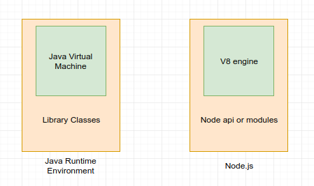

### **1. React component types**

Function component:
```javascript
function Welcome(props) {
  return <h1>Hello, {props.name}</h1>;
}
```

Class component:
```javascript
class Welcome extends React.Component {
  render() {
    return <h1>Hello, {this.props.name}</h1>;
  }
}
```

The differences:
- Function component is just a plain JavaScript function, you cannot use setState() in your component. If you want to use state, you have to use Class component or Pass the state from Parent component to props in Function component. But since React 16.8, you can use "State Hook" (**useState**) to use state. https://zh-hans.reactjs.org/docs/hooks-state.html
- Functin component don't have lifecycle. But you can use "Effect Hook" (**useEffect**) since React 16.8. https://reactjs.org/docs/hooks-effect.html
- Function component without State Hook and Effect Hook is **stateless**. Class component is **stateful**

When to use Function component:
- When there are only presentational elements, no state and lifecycle to manage.

<br/>

### **2. React Lifecycle**

**Mount:**
- constructor()
- static getDerivedStateFromProps()
- render()
- componentDidMount()

**Update:**
- static getDerivedStateFromProps()
- shouldComponentUpdate()
- render()
- getSnapshotBeforeUpdate()
- componentDidUpdate()

**UnMount:**
- componentWillUnmount()

More: https://zh-hans.reactjs.org/docs/react-component.html

<br/>

### **3. JSX JavaScript eXtension**

<br/>

### **4. Node.js**

Node.js is a Javascript runtime environment.
It's built on top of **Chrome's V8 JavaScript engine**.

Every browser has their own Javascript engine that converts javascript into code that a computer can understand. For example, Microsoft Edge uses Chakra, Firefox uses SpiderMonkey, and chrome uses V8. This explains why JavaScript code can behave differently in other browsers.

In 2009, Ryan Dahl took Chrome's V8 engine, and put it into a C++ program, to be able to run JavaScript out of web browers, and named in Node.



More:
https://medium.com/@michaelhenderson/what-is-nodejs-and-why-you-need-to-learn-it-f0760ba9a76a
https://www.freecodecamp.org/news/what-exactly-is-node-js-ae36e97449f5/

<br/>

### **5. NPM vs NPX**

**NPM**: Node Package Manager

- NPM is a CLI tool to install, manage Node.js applications
- NPM is the largest online Node.js packages repository in the world

**NPX** is a CLI tool comes with npm version 5.2.

NPM install the package in global scope, and NPX install package in local scope temperarily.

**Create react-app with NPM:**

```javascript
> npm install -g create-react-app // Install create-react-app  in the machine
> create-react-app my-react-app    // create an app with create-react-app
```

**Create react-app with NPX:**

```javascript
> npx create-react-app my-react-app    // create an app with create-react-app
```

More:
https://www.freecodecamp.org/news/npm-vs-npx-whats-the-difference/
https://medium.com/itsems-frontend/whats-npx-e83400efe7f8
https://juejin.im/post/6844903945664462855

<br/>

### **6. Create React App**

Create React App is an officially supported way to create single-page React applications. It offers a modern build setup with no configuration.

```bash
> npx create-react-app my-app
```

<br/>

### **7. NPM commands**

- **npm start**:  starts the development server and auto-reloads the page any time you make edits
- **npm run build**:  bundles the app into static files for production
- **npm test**: starts the test runner and lets you test your app with Jest as you build it
- **npm run eject**:  takes your app out of the create-react-app setup, which lets you customize your project configuration

<br/>

### **8. Redux**

Redux is a pattern and library for **managing and updating application state**, using events called **actions**.

It serves as a centralized store for state that needs to be used across your entire application, with rules ensuring that the state can only be updated in a predictable fashion.

<br/>


