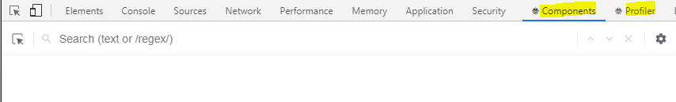
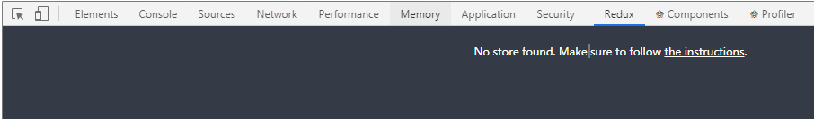

### **1. Install NodeJs & NPM (Node Package Manager):**

https://nodejs.org/en/download/

<br/>

### **2. Install extensions in Chrome or Firefox**

- **React Developer Tools**

Open a page developped by ReactJS, and Press F12 in Chrome, there are two new tabs: "Components" and "Profiler" appeared.



- **Redux DevTools**



<br/>

### **3. React recommended toolchains**

- If you’re learning React or creating a new single-page app, use **Create React App**.
- If you’re building a server-rendered website with Node.js, try **Next.js**.
- If you’re building a static content-oriented website, try **Gatsby**.
- If you’re building a component library or integrating with an existing codebase.
  - **Neutrino** combines the power of webpack with the simplicity of presets, and includes a preset for React apps and React components.
  - **Nx** is a toolkit for full-stack monorepo development, with built-in support for React, Next.js, Express, and more.
  - **Parcel** is a fast, zero configuration web application bundler that works with React.
  - **Razzle** is a server-rendering framework that doesn’t require any configuration, but offers more flexibility than Next.js.

<br/>

### **4. Create React app**

```javascript
> npx create-react-app my-app //Create a new react app with create-react-app
> cd my-app
> npm start
```

<br/>

### **5. React UI libraries**

- Ant Design: https://ant.design/index-cn
- Material-UI: https://material-ui.com
- React Bootstrap: https://react-bootstrap.github.io

Install Ant Design:

```bash
> npm install antd --save
```

<br/>

### **6. Tools**

- **A package manager**, such as **Yarn** or **npm**
It lets you take advantage of a vast ecosystem of third-party packages, and easily install or update them.
- **A bundler**: such as **webpack** or **Parcel**.
It lets you write modular code and bundle it together into small packages to optimize load time.
- **A compiler such as Babel**.
It lets you write modern JavaScript code that still works in older browsers.

<br/>

